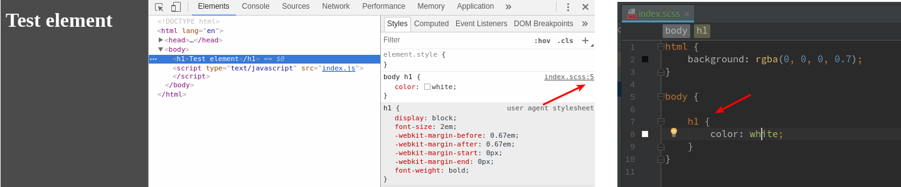

### webpack-sass-loader-sourcemap-issue

This repo is an example of `sass-loader` issue with generating sourcemaps for nested elements - See [Issue 272](https://github.com/webpack-contrib/sass-loader/issues/272)

#### Running

After cloning this repo, run `npm install`, then `npm start` and open browser at [http://localhost:8080](http://localhost:8080)

#### Issue

